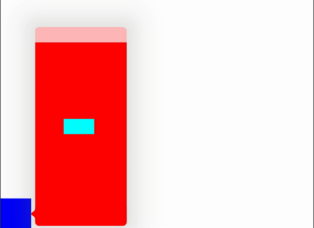

# Popover loadview bugreport

## Description

In that case when you have a navigation controller in a popup which contains a viewcontroller and if viewcontroller overrides the loadView method. Then after the keyboard comes up the viewcontroller size remains the same. You can see at demonstration the textfield in the middle of the viewcontroller but after the keyboard come up the keyboard will be over the textfield.

Demonstration:

With loadView:

Without loadView:

## Steps to reproduce

1. Clone this project
1. Run the `PopoverBugReport` target
1. Open popover with the blue button.
1. Open keyboard with the textfield.
1. Textfield will be hidden because the view does not resize. Textfield constrained to the middle of the view so it should be in the middle of the popover after the popover has resized.

## Bug report

Reported to Apple as FB7601560.
